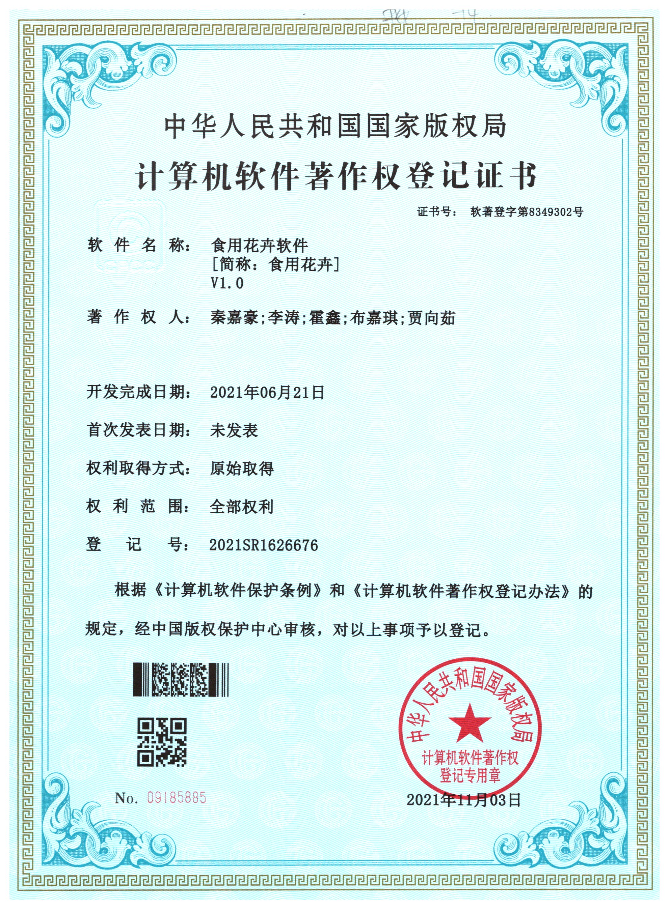

# EdibleFlowers
食用花卉——基于Android的实战项目

## 一、 项目背景

​                近年来，饱受现代“文明病”之害的欧美国家，兴起了一股食花热，并响亮的提出“饮食回归自然”的口号，在各地的餐馆中，家庭的餐桌上、菜谱上不乏花影，食花之风经久不衰。近三十年来，中国人的饮食观念的演变，使人们的饮食习惯更加注重健康自然，更加注重菜肴对人体自身的滋养功能，人们健康观念的转变也必然带动餐饮消费文化的转变。花卉美食取材天然、无公害、个性突出，成菜造型逼真、营养均衡，具有高纤维、低脂肪的特点，富含氨基酸和人体必需的多种微量元素和矿物质，符合当代人追求生态、环保、营养、健康的饮食诉求。因此以食用花卉为核心，进行美食创意开发和餐饮业态创新势在必行。

​                食用花卉在开发中还存在很多盲点，亟待解决: 一是食用花卉的种植面积不大，食用花卉数量稀少，目前仍属高档食品之列，在各类市场上价格较高，大多销往高档酒店，价格不容易被普通老百姓接受;二是缺乏对食用花卉营养成分的量化分析。很多人都吃过蒲公英等野生植物，往往都是来自从过去年代走过的老一辈人的传承。但到底哪些花卉可以吃?可以吃花卉具体哪个部位?具体到每个可以吃的花卉中含有哪些微量元素?都有哪些保健功能?大部分人都说不清楚。三是食用花卉的保鲜问题没有得到很好解决。因此本APP（六寸光阴）应运而生，旨在为广大群众提供正确的花卉认识。

**软件后端链接**

[食用花卉服务器端]: https://github.com/OptimistQAQ/SixInchLightServer	"食用花卉服务器端"

## 二、项目功能

### 食用花卉

- 对目前已有的花卉菜肴、花卉饮品，进行汇总、分类，展示其营养价值。

### 食用花卉识别
- 对各类食用花卉能够进行准确识别，分析该类食品得营养成分。

### 食用花卉寓意
- 对食用花卉的文化进行宣传，具体形式未定，将食用花卉文化发扬光大。

#### 首页

- 今日花卉 （每日随机展示一种花卉）
- 花卉识别

#### 资讯

- 精选
- 分类
- 新闻
- ...

#### 我

- 应用设置
- 帐号管理
- 我的收藏
- 关于
- 退出登陆

## 三、软著

本项目以申请软件著作权保护。

## Open Source

https://github.com/xiaohaibin/XBanner

https://github.com/H07000223/FlycoTabLayout
